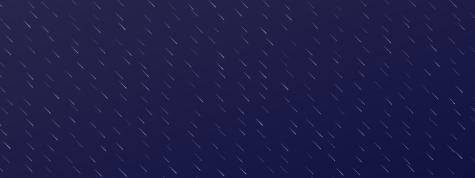

# Random SVG background generator

Generate beautiful random SVG backgrounds on Node.js runtime.

## Installation

```bash
npm i -S bgsvg
# or
yarn add bgsvg
```

### Install peer dependencies

```bash
npm i -S chroma-js@2.4.2 happy-dom@14.12.3
# or
yarn add chroma-js@2.4.2 happy-dom@14.12.3
```

## Supported SVG backgrounds

## Meteors

```ts
import { meteors } from "bgsvg";

const svg = meteors({
  width: 800,
  height: 300,
  background: "#222299",
  color: "#952E9D",
  min: 35,
  max: 40,
  thickness: 4,
  bidirectional: true,
});

console.log(svg);
// <svg xmlns="http://www.w3.org/2000/svg" width="800" height="300" viewBox="0 0 800 300"...
```


| Option        | Default value | Description                     |
| ------------- | ------------- | ------------------------------- |
| width         | -             | Width of the SVG                |
| height        | -             | Height of the SVG               |
| background    | -             | Background of the SVG           |
| color         | -             | Color of the meteors            |
| min           | 35            | Minimum number of meteors       |
| max           | 40            | Maximum number of meteors       |
| thickness     | 4             | Thickness of meteors            |
| bidirectional | true          | Show meteors falling and rising |

SVGs can have a solid color or a gradient background depending on the value of the `background` option.

```typescript
export type CanvasBackground =
  | string
  | {
      x1?: string;
      y1?: string;
      x2?: string;
      y2?: string;
      colors: [string, string];
    };
```

## rain

```ts
import { rain } from "bgsvg";

const svg = rain({
  width: 800,
  height: 300,
  background: {
    colors: ["#081e46", "#181f74"],
  },
  color: "#952E9D",
  dropsX: 20,
  dropsY: 15,
  thickness: 1,
});

console.log(svg);
// <svg xmlns="http://www.w3.org/2000/svg" width="800" height="300" viewBox="0 0 800 300"...
```



| Option     | Default value | Description                                |
| ---------- | ------------- | ------------------------------------------ |
| width      | -             | Width of the SVG                           |
| height     | -             | Height of the SVG                          |
| background | -             | Background of the SVG                      |
| color      | -             | Color of the rain drops                    |
| dropsX     | 20            | Number of drops on the X-Axis (horizontal) |
| dropsY     | 15            | Number of drops on the Y-Axis (vertical)   |
| thickness  | 1             | Thickness of the drop                      |

# Development

## Installation

```bash
yarn install
```

## Preview server

```bash
yarn preview
```

This commands starts an express server at `http://localhost:3003` to display how the SVGs would look like.
