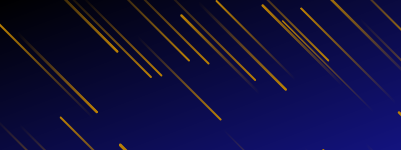

# Random SVG background generator

Generate beautiful random SVG backgrounds on Node.js runtime.

  

## Installation

```bash
npm i -S bgsvg
# or
yarn add bgsvg
```

## Supported SVG backgrounds

## Meteors

```ts
import { meteors } from "bgsvg";

const svg = await meteors({
  width: 800,
  height: 300,
  background: {
    colors: ["#000000", "#13137f"],
  },
  color: "#ba8003",
  densityX: 30,
  densityY: 2,
  thickness: 4,
  bidirectional: true,
  output: {
    type: "svg",
  },
});

console.log(svg);
// <svg xmlns="http://www.w3.org/2000/svg" width="800" height="300" viewBox="0 0 800 300"...
```



| Option        | Default value | Description                          |
| ------------- | ------------- | ------------------------------------ |
| width         | -             | Width of the SVG                     |
| height        | -             | Height of the SVG                    |
| background    | -             | Background of the SVG                |
| color         | -             | Color of the meteors                 |
| densityX      | 30            | Average density of meteors on X-Axis |
| densityY      | 2             | Average density of meteors on Y-Axis |
| thickness     | 4             | Thickness of meteors                 |
| bidirectional | true          | Show meteors falling and rising      |
| output        | {type: 'svg'} | Output format                        |

SVGs can have a solid color or a gradient background depending on the value of the `background` option.

```ts
export type CanvasBackground =
  | string
  | {
      x1?: string;
      y1?: string;
      x2?: string;
      y2?: string;
      colors: [string, string];
    };
```

You can generate SVG, PNG, JPEG, and Webp image based on the `output` option. When the output format is not SVG, then an image `Buffer` is returned.

```ts
type OutputTypeSvg = { type: "svg" };
type OutputTypePng = { type: "png" };
type OutputTypeWebp = { type: "webp" };
type OutputTypeJpeg = { type: "jpeg"; quality?: number };
```

## rain

```ts
import { rain } from "bgsvg";

const svg = await rain({
  width: 800,
  height: 300,
  background: {
    colors: ["#27274c", "#121242"],
  },
  color: "#8f97c1",
  densityX: 20,
  densityY: 15,
  thickness: 1,
  randomness: 4,
});

console.log(svg);
// <svg xmlns="http://www.w3.org/2000/svg" width="800" height="300" viewBox="0 0 800 300"...
```


| Option     | Default value | Description                                    |
| ---------- | ------------- | ---------------------------------------------- |
| width      | -             | Width of the SVG                               |
| height     | -             | Height of the SVG                              |
| background | -             | Background of the SVG                          |
| color      | -             | Color of the rain drops                        |
| densityX   | 20            | Average density of drops on X-Axis             |
| densityY   | 15            | Average density of drops on Y-Axis             |
| thickness  | 1             | Thickness of the drop                          |
| randomness | 4             | Randomness of the drops (more value, the less) |
| output     | {type: 'svg'} | Output format                                  |

# Development

## Installation

```bash
yarn install
```

## Preview server

```bash
yarn preview
```

This commands starts an express server at `http://localhost:3003` to display how the SVGs would look like.

## Test

```bash
yarn test
```
